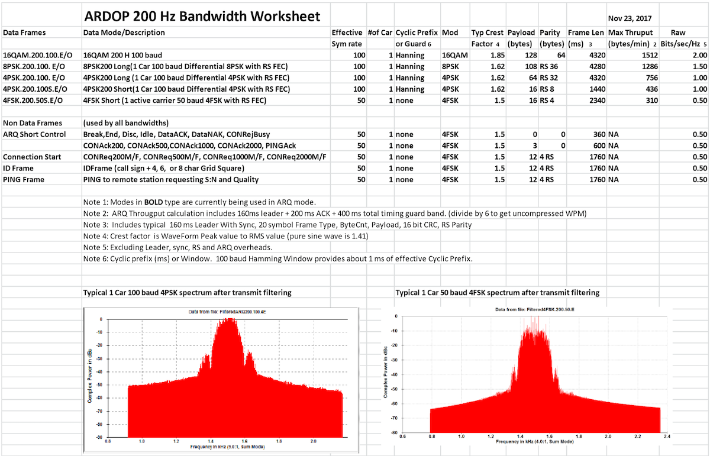
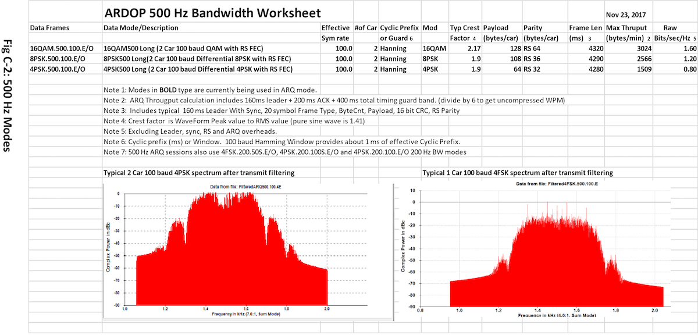
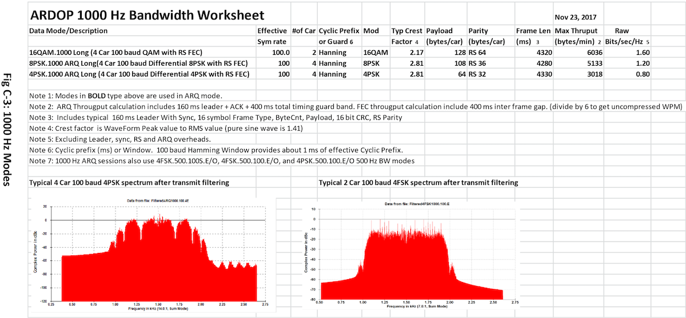
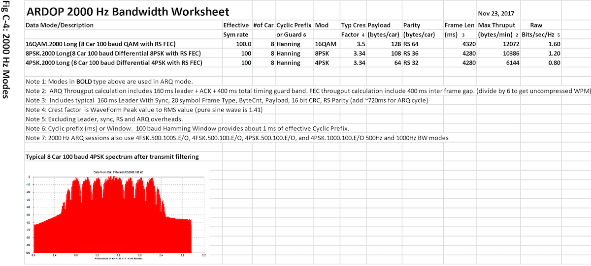
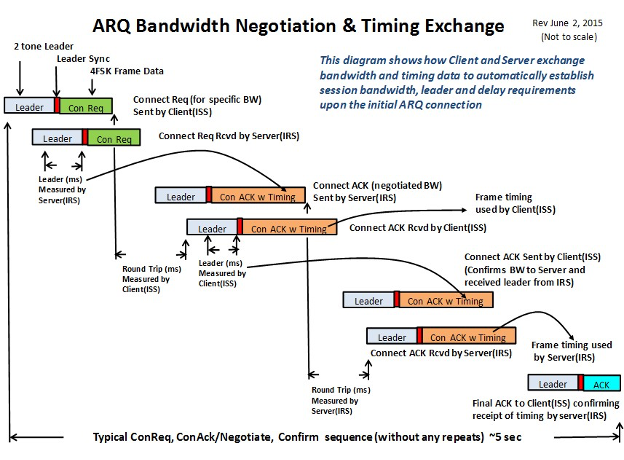
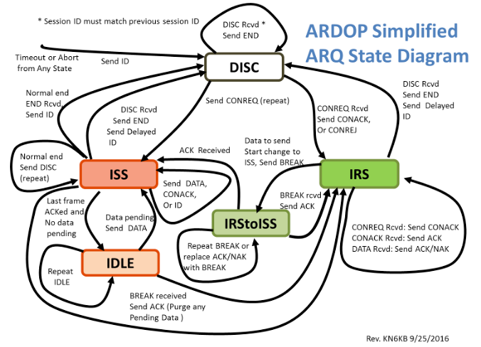
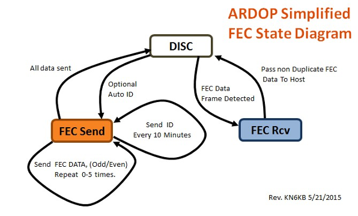
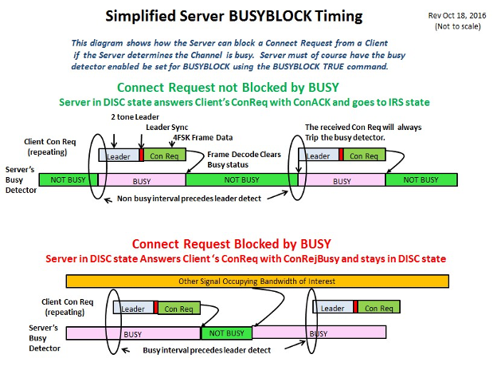
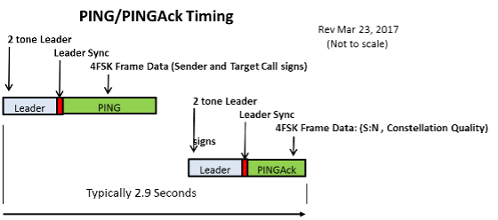

# Amateur Radio Digital Open Protocol (ARDOP) Specification

Prepared by Rick Muething, KN6KB
Revision 2.0
Nov 27, 2017

## 1.0 Overview

### 1.1

This document design document that describes the Amateur Radio Digital Open Protocol (ARDOP). This
document may be expanded and modified as the development effort evolves and represents the
complete public specification for the protocol. The specification and the protocol are released to the
public domain. Readers that have questions or comments about the spec or the protocol use are
encouraged to contact the author at: [rmuething@cfl.rr.com](mailto:rmuething@cfl.rr.com)

## 2.0

Project Target Objectives:

### 2.1

The ARDOP is based loosely on and inspired by the popular WINMOR (Winlink Message Over Radio)
protocol by Rick Muething, KN6KB. Though it has some similarities to WINMOR it is not intended to be
compatible with or to communicate with the WINMOR protocol. That requirement would likely
dramatically compromise the performance and complicate the development of the ARDOP.

### 2.2

Bandwidth: The protocol is intended to operate in one of four audio bandwidths, 200 Hz, 500 Hz, 1000
Hz, and 2000 Hz as measured at the -26 dB points of the transmitted spectrum. There are three
methods two connecting stations can establish the session bandwidth:
a) Forced by Client (the station sending the connect request forces the bandwidth)
b) Forced by Server (the station receiving the connect request forces the bandwidth)
c) Negotiated by the lower of Server’s or Client’s maximum bandwidth setting.
The Client or Server will have the ability to reject a connection request that is not bandwidth compatible
or when the server detects prior signals in the passband (Listen before Transmit or Busy Detector). This
minimizes the chance of interference to existing connections and conformance to local applicable
bandwidth rules for spectrum segments. In FEC (broadcast or multicast) mode any of the 4 bandwidths
and any of the data frames can be used allowing tradeoff in bandwidth, robustness and throughput.
ARQ sessions may use data modes that are equal to or less than the session bandwidth. This permits
dropping down to lower bandwidth modes for improved robustness or reduced interference.

### 2.3

Speed – Robustness Agility: The ARDOP ARQ protocol is intended to be able to automatically operate
over a wide range of channel types, data rate and robustness levels. It should adapt to propagation
seeking the best nominal modulation (and bandwidth in some cases) to maximize net error-free
throughput. This is optimized by ACK/NAK back channel frames that communicate the received signal’s
average decoded symbol constellation quality back to the data sending station. The range in net (after
FEC) throughput is approximately 38:1 (fastest and least robust 2000 Hz mode: slowest and most robust
200 Hz mode)

### 2.4

Minimum Crest Factor: The protocol uses modulation types and techniques to minimize the crest factor
(Peak to RMS Power). The nominal crest factor will range from 1.5 to 3.5 (a pure sine wave has a Peak
to Average or crest factor of 1.41). This will maximize transmitted energy from a transmitter limited to
a max PEP rating (most amateur SSB transmitters)

### 2.5

Compliance with US FCC Symbol rate rule: The maximum symbol rate on any carrier of SSB HF modes
shall be 300 baud or less (Currently 50 and 100 for HF and 600 baud for VHF/UHF FM). This is in
conformance to the current US FCC rules. The 600 baud modes are designed for FM operation above 29
MHz. Additional modes for higher speed VHF/UHF using baud rates > 600 Hz may be added.

### 2.6

Strong Resistance to Multipath propagation: The protocol shall use techniques (low symbol rates,
OFDM carriers with cyclic prefix, nFSK, etc.) to optimize performance under poor multipath conditions
(path delay variation up to 2 ms).

### 2.7

To minimize the chance of interference with other existing usage of a frequency the implementation
includes features such as listen before transmit and busy detectors and the ability to reject connections
or change bandwidths if channels are detected busy (BUSYBLOCK).

### 2.8

Implementation: There will be several implementations compatible with a number of platforms. These
will include:

#### 2.8.1

Software implementations (virtual TNC with “sound card”) on Windows, Linux, Apple, and
Android (with Parallels, Bootcamp, or VMware if needed). These would also integrate easily
with newer radios with built in sound cards. Windows and Linux versions currently in testing.

#### 2.8.2

Dedicated single chip CPUs or DSPs. DSP implementation will be chosen to minimize the
demand for extensive storage buffers and high speed floating point. Prototypes of SBC
implementations using C are operational.

### 2.9

Operating Modes and Radios: The protocol is intended for HF SSB and VHF/UHF both SSB and FM.
Timing parameters cover extended range to accommodate these mode as well as SDR (Software Defined Radios, e.g. Flex).

### 2.10

Automatic Timing Setup: The protocol can operate in FEC (broadcast or multicast) or ARQ (connected)
mode with automatic timing setup. This feature allows the automatic setup of frame and leader timing
to cover alternate keying methods and Software Defined Radio timing and insures automatic timing
adjustment for near optimum throughput. This automatic timing also permits using carrier or sub tone
keyed repeaters (e.g. voice repeaters) on VHF/UHF. This however should only be done when
coordinated with the local repeater management group.

### 2.11

Automated Path Measurement (PING): The Protocol includes two special (200Hz BW) frames PING and
PINGAck. These allow a station (the one sending the PING) to make a quick (typically < 3 seconds)
assessment of the propagation to a distant station (the PING Target) by receiving the remote stations
PING decode parameters (S:N and Constellation Quality)

## 3.0

Compatibility:
This specification does not cover the mechanism or specific code used to implement the ARDOP protocol and
modem. This could be either a “virtual TNC” software/sound card implementation running under one of several
operating systems and platforms or a dedicated CPU/DSP chip implementation containing its own sound card.
However to insure interoperability between implementations it is required that each implementation that
identifies itself as “ARDOP compatible or compliant” successfully complete and document a
compatibility/conformance test that covers the primary operating modes of the protocol. This mechanism for
this test will be documented in separate document. It is recommended but not required that software or
firmware implementations of the ARDOP be released as open source (need definition of specific open source
license mechanism here) however modifications to the open source software MUST successfully pass the
compatibility test to be able to claim they are ARDOP compliant.

## 4.0

Equipment Compatibility:

### 4.1

Frequency accuracy. The protocol shall accept a connection request where the Client and Server
frequencies are offset by up to 200 Hz for HF and VHF/UHF SSB modes. Frequency stability. The short
term frequency stability of the transmitter and receiver shall be less than 1 Hz/second for SSB operation.
Operation at worse frequency accuracy and stability is possible with FM modes e.g. VHF/UHF FM.

### 4.2

Sound Card Compatibility: The protocol shall be compatible with the majority of common PC sound
cards and radios with built-in sound cards (e.g. Icom 7100, 7200, 7300, 7410, 7600, 9100, Yaesu FT991A,

## Page 3

and Kenwood TS-590S/SG). A sound card sampling rate offset from nominal of +/- 1000 ppm shall be
accommodated but may result in some performance degradation. The preferred sample rate offset
shall be +/-100 ppm. The sampling rate selected shall be as low as possible (currently 12000
samples/sec) to provide good performance with minimum CPU demand and consistent with the
common “cardinal” sound card rates (12000, 48000, or 96000 samples per second) which have
historically been more accurate than other sample rates.

### 4.3

Software Defined Radios. The protocol will support manual or automatic leader and trailer timing
modification to accommodate latency generally found in common SDR type radios (e.g. Flex radios or
SDRs employing Virtual Audio Cables).

### 4.4

The protocol shall support all popular digital keying modes. This includes: transmitter “CAT” PTT
control, dedicated serial port control (using RTS or DTR levels), conventional VOX control, and SignalLink
or Rigblaster Advantage type integrated sound card VOX interfaces. The automatic timing mechanism
will accommodate reasonable (up to 300 ms) VOX release delays but at some degradation in net
throughput.

### 4.5

The protocol includes features to automatically accommodate reasonable variations in round trip
timing, operating system latency, and keying latency. These are adjusted automatically where possible
or via an ini (setup parameter) file if necessary.

### 4.6

Host Interface. The ARDOP modem/TNC is intended to be a software/firmware implementation of a
hard ware modem. It is intended to interface to the Host program using either a TCPIP connection (CPU
local or wired/wireless to local network or remote location over the internet), Serial (RS-232 or USB) or
Bluetooth (>= 19K baud). Details of the host interface are in a separate Interface document.

## 5.0

Operating Modes:

### 5.1

For error free data transmission the protocol will normally operate in an ARQ (Automatic Retry reQuest)
mode where TWO stations are connected. The stations will operate ARQ where each data frame from
the Information Sending station (ISS) is acknowledged by the Information Receiving Station (IRS). In a
normal forwarding session the rolls of IRS and ISS will be exchanged several times. The
acknowledgement transmission (ACK or NAK) from the IRS will include information on the received
signal average decoded symbol constellation quality to aid the ISS in optimizing the modulation mode
for maximum net (after repeats and corrections) throughput. An ARQ connection will use a session ID
which helps “insulate” a connected session from any adjacent on-going ARQ session. Specific ARQ
session rules and state diagram are included in Appendix D.

### 5.2

An alternate FEC operating mode is provided for robust “broadcast” or “multicast” capability for the
transmission to many simultaneous listeners. Since there is no “back channel” such a FEC broadcast
mode cannot be guaranteed to be error free but may be of value in some applications. The FEC
broadcast mode allows for the broadcaster to adjust the robustness level of the transmission
(bandwidth, modulation mode, and number of FEC frame repeats). FEC Protocol rules and state
diagram is detailed in Appendix D.

### 5.3

The protocol (ARQ or FEC) can be “monitored” by a non-connected station but since there is no
mechanism for a monitoring station to request a retransmission of a missed frame there may be “holes”
or errors in the monitored data.

### 5.4

PING and PINGAck frames may be exchanged and monitored in either FEC or ARQ modes but ONLY
when operating in the DISC (Disconnected) protocol state.

## 6.0

Operating Bandwidth:

### 6.1

The protocol uses a mechanism to allow both forced and negotiated session bandwidth between the
Client and Server. This permits Servers (often unmanned) to be able to restrict bandwidth when
necessary to conform to country or regional rules or to minimize chances for interference.

### 6.2

The 200 Hz single carrier mode is intended to be primarily used for keyboarding and QRP operations.
This is compatible with SMS and lower speed applications (up to 1500 bytes per minute, roughly 250 words/min with
uncompressed text) message or small file exchange. The 200 Hz data modes are compatible with and
are used in conjunction with the higher bandwidth modes.

### 6.3

The ARQ connection mechanism used automatically establishes the connected session bandwidth. Each
station sets a bandwidth parameter in its setup that defines either the max bandwidth or the forced
bandwidth (200Hz, 500Hz, 1000Hz, or 2000Hz).
The client station initiates the session with a connect request for its selected bandwidth. Appendix D
describes the specific rules and mechanism the calling and target stations use to negotiate a compatible
bandwidth or end a session if no compatible bandwidth is available.

## 7.0 Frame Types: (See appendix B for details)

### 7.1 Up to 256 frame types may be defined. ACK and NAK frame types include a small data field (5 bits) to indicate

the decode quality of the received data frame. Therefore each ACK and NAK frame code uses 32 allocations of
the 256. Every frame shall contain as a minimum:

#### 7.1.1

Tuning leader for all bandwidths consisting of a 50 baud two tone signal (1475 and 1525 Hz) used for
robustness and provides a mechanism for detection and rapid DSP tuning to within approximately 1 Hz.
The two tone leader provides a DSP mechanism to reject single tone carriers and to establish initial
symbol sync based on the envelope correlation of the two tone waveform.

#### 7.1.2

Frame Sync is a single symbol of the leader with reversed phase (e.g., non-alternating phase of the 1500
Hz two tone leader).

#### 7.1.3

After the frame sync each frame will contain 10 50 baud 4FSK symbols using a single active carrier. The
10 symbols encode 2 bytes + 2 parity symbols. The first byte is the frame type and the second byte is
the frame type XORed with an 8 Bit Session ID. The session ID is derived from a CRC hash of the two
connected call signs. When sending FEC (broadcast) data and some ARQ frame types the session ID will
be forced to Hex FF. This provides the ability for non-connected stations to more easily monitor these
frames. The 4FSK decoding of the frame type bytes uses minimal distance soft decoding for improved
robustness.

### 7.2 Frame Type Basic Description (specific encoding in Appendix B)

#### 7.2.1

 Connect Request. (CONREQ200M, CONREQ500M, CONREQ1000M, CONREQ2000M, CONREQ200F,
CONREQ500F, CONREQ1000F, CONREQ2000F) Includes additional data to include the call signs (up to 7
characters + optional –SSID of “-1” through “-15” and “-A” through “-Z”) of the originating and target
stations and the Requested bandwidth (200, 500, 1000, 2000 Hz). This frame always uses a session ID
of Hex FF. The two call signs are used by the receiving station to determine the specific session ID using
an 8 bit CRC hash of both call signs. The 8 bit session ID will be used in computing the second Frame ID
byte of all connected data and ACK/NAK frames to provide a measure of insulation against cross
session ACK/Data contamination. (Two or more sessions operating on or near the same frequency).

#### 7.2.2

Short Control frames: (typically 360 ms total length) All of these included the embedded session ID
XORed with the frame type as the second frame type byte to reduce the chance of cross connection
contamination.

#### 7.2.3

PING Frame. The PING frame is the same length and coding as the ConnectRequest frame and sends a
short (typically 1.9 sec) frame to a target station requesting the received S:N and decode Quality.

##### 7.2.3.1 DATANAK Frame received by the IRS when the ID and frame type decoded correctly but failure of data CRC after

all FEC and data averaging recovery. Up to 5 bits of Decode quality information included in the DATANAK (uses
up 32 of available 256 frame types). If the frame type and ID were NOT decoded correctly from the ISS there is
no reply from the IRS. The quality reported ranges from 38 to 100 in steps of 2. A Quality value of 60 or above is
typically required for practical decoding.

##### 7.2.3.2 DATAACK Frame received by the IRS when the Frame type and ID and all frame data was correctly decoded. Up

to 5 bits of decode quality information included in the DATAACK (uses up 32 of available 256 frame types).
Decode quality in the ACK helps the ISS determine whether faster or more robust modes would be more
optimum. The quality reported ranges from 38 to 100 in steps of 2. A Quality value of 60 or above is normally
required for decoding.

##### 7.2.3.3 BREAK Used by the IRS to signal to the ISS the intent to take control of Link to become the new ISS

##### 7.2.3.4 IDLE Sent by the ISS when it has no data to send. The IDLE is answered by the IRS with either an ACK (continue

Idling) or BREAK (initiate an IRS-to-ISS exchange)

##### 7.2.3.5 END (Confirms End the session) may be initiated by the IRS or ISS

##### 7.2.3.6 CONACK200 Connection Acknowledge. Session BW = 200 Hz. All CONACK frames contains a 1 byte data field

(repeated 3 times for redundancy) which signals the sending station the received leader length (in 10’s of ms).
This is used to establish automatic timing parameters (see appendix D Fig. D-1).

##### 7.2.3.7 CONACK500 Connection Acknowledge. Session BW = 500 Hz

##### 7.2.3.8 CONACK1000 Connection Acknowledge. Session BW = 1000 Hz

##### 7.2.3.9 CONACK2000 Connection Acknowledge. Session BW = 2000 Hz

##### 7.2.3.10

PINGAck is the same size as the CONACK frames and is intended to answer a PING frame with the
received S:N and approximate Constellation quality.

##### 7.2.3.11

CONREJBW Connect Reject Bandwidth. Reject the connect request due to incompatible bandwidth
settings. (e.g. Client has 500 Hz forced, Server has 2000 Hz forced)

##### 7.2.3.12

DISC. Disconnect Request. Signals a disconnect is desired. An answer with an END will terminate the
Link. (See ARQ Protocol rules Appendix D)

##### 7.2.3.13

IDFRAME Special frame to ID call sign and four, six, or eight character grid square of the sending station.
Does not require acknowledgement and is ignored by a connected station(ARQ) or any monitoring station (FEC).
Allows legal ID and can be monitored by non-connected stations. The ID frame is automatically inserted at least
every 10 minutes by the current ISS. If the station sending the ID frame has CW ID enabled the ID frame will be
followed by a CW call sign ID using FSK keying at 20 wpm or less.

##### 7.2.3.14

Data Frames: A number of data frames are provided which can be automatically selected by the ISS
(based on the session bandwidth and decode quality received from the IRS) to adjust data speed, robustness
and bandwidth. These may include some long (~4-5 seconds) and short (~2-second frames) to optimize
throughput and small packet turnaround (improved efficiency in keyboarding and message forwarding
protocols). Detailed spread sheets in Appendix B identify these frames, their modulation mode, content, max
throughput and FEC mechanism. Any data frame may be sent in either ARQ (connected session) or FEC
(broadcast/multicast) transmission.

## 8.0 Host Program interface

### 8.1 The ARDOP TNC/Modem is intended to work with a host program much the same way as a physical TNC

requires interfacing to a host or terminal program. This section outlines the basics of that Host TNC
interface. (Actual Host commands/responses are supplied in a separate document)

#### 8.1.1

Interface Protocol: The protocol will assume a computerized interface at the host end (no direct
manual keyboard command). The protocol will be initiated by a connection request to the
ARDOP TNC through either a TCPIP, or virtual COM port (RS232, RS422, or Bluetooth) serial link.
The links may be wireless (e.g. WiFi, Bluetooth etc.). The protocol for the Host interface shall be
a combination of command response/acknowledge commands and asynchronous data
transfers. These are be detailed in a separate host interface document.

#### 8.1.2

Interface Security. The installation of the ARDOP TNC shall indicate the following in either a
basic set up menu or command line launch argument.

##### 8.1.2.1.1

Interface Type used TCPIP, Serial RS232, or BlueTooth Link

##### 8.1.2.1.2

TCPIP Address and port numbers or COM Port and Baud rate or BlueTooth
pairing used

##### 8.1.2.1.3

Once the host login is accomplished the host can change most operating
and setup parameters except the Host interface parameters.

##### 8.1.2.1.4

Fail safe mechanism will be provided at the Host interface to insure the
radio link is disconnected and the transmitter set to receive upon any loss of
the Host interface.

## 9.0 Optional Radio Interface

### 9.1 Since the ARDOP TNC will normally have a close physical proximity to the transmitter and because some

Transmitter control functions (e.g. PTT on/off) are time-critical to ARQ protocols an optional radio interface
may be provided in the ARDOP TNC/Modem. The Host program can still implement radio control by itself or
via other third party radio control software but some transmitter keying mechanisms (e.g. CAT PTT keying)
may not be appropriate in some installations due to timing considerations.

### 9.2 In remote installations where the Host program may be remote from the ARDOP TNC/Modem radio control

by the TNC/modem is the preferred mechanism. The ARDOP modem can be set up to interface (serial
RS232 or USB serial) to control the radio including Frequency control, filter control, PTT on/off control and
Aux mux control by those radios using integrated sound cards. (Kenwood TS-590S/GS, Icom 7100, 7200,
7300, 7410, 7600, 9100, Yaesu FT991/A). The initial ARDOP implementation will try to include support for
most amateur and marine radios.

## Appendix A: Revision History

This contains a brief revision history to changes made in the specification including its appendices.

### Revision 2.0 Nov 23, 2017 Rick Muething, KN6KB

- Updated frame documentation spreadsheets. Some modes eliminated and added based on work using the HF
- simulator and optimization of the Mode shifting algorithms. Other minor updates.

### Revision 0.1.7 May 17, 2014, Rick Muething, KN6KB

- Added 200 Hz mode to specification. Eliminated ACKEVEN and ACKODD replaced with DATAACK
- Modified Appendix B Detailed Frame Description. Added reference to and placeholder Appendix D Host
interface.
- Moved ARDOP Conformance Requirements to Appendix E.(place holder)

### Revision 0.1.8 May 29, 2014, Rick Muething, KN6KB

- Modified Operating Bandwidth and Frame Type sections. Updated worksheets in Appendix C.
- Added sections 8 Host Program Interface and 9 Optional Radio Interface
- Update of Appendices B and C

### Revision 0.1.9 June 5, 2014, Rick Muething, KN6KB

- Modified Callsign fields to 7 characters + optional –SSID of “-1” through “-Z”. This shortens the Connect Request
frame and ID frame to typically 1040 ms.

### Revision 0.1.10 June 12, 2014, Rick Muething, KN6KB

- Modified All frame type spread sheets (Appendix C) to show PSK modes at 100 and 167 effective baud rates.
- Removed frame types REQPSN, LASTPSNE, LASTPSN O …not needed.

### Revision 0.1.11 Nov 18, 2014, Rick Muething, KN6KB

- Update bandwidth measurement to -26 dB point (was -30. in Section 2.2)
- Update speed/robustness range to 22 in Section 2.3
- Clarification of Crest factor range in Section 2.4
- Modify BlueTooth interface options in section 8
- Eliminate serial and USB host interface options in Appendix D

### Revision 0.1.12 Nov 26, 2014

- Minor text corrections. Add Frame Type spread sheet to appendix B.

### Revision 0.1.13 Dec 9, 2014

- Change all 4PSK 72 data + 24 parity carriers to 64 data + 32 Parity. Same length and improved net throughput in
all but very good channels. Update all mode spread sheets and spec Appendix C.
- Fixed multi carrier per carrier reference phase initialization in EncodeModulate.ModPSK to always force 0 as
reference (was i Mod 4)

### Revision 0.1.14 Jan 2, 2015

- Make mods to Host interface allowing RS 232 connections as well as TCPIP and BlueTooth.

### Revision 0.2.0. Feb 10, 2015

- Addition of protocol Rules Appendix D. Modifications to frame type CONACK to include leader timing data. Elimination
of OVER frame type. General cleanup of text and spread sheet in appendices B and C.

### Revision 0.3.0. Mar 3, 2015

- Addition of 4FSK robust data modes (50 and 100 baud), 200, 500, 1000, and 2000 Hz bandwidths. Elimination of
different frame types for ARQ and FEC modes.
- Modification of all control frame details and codes and Data frame type bytes to use 4FSK 50 baud modulation.
- Update of frame spread sheets. Appendices B and C.

### Revision 0.3.1 Mar 25, 2015

- Addition of Timing diagram D-1 to appendix D.

### Revision 0.6 July 1, 2015 (Corresponds to the end of Alpha Testing)

- Addition of details on FM modes.

### Revision 1.0 Mar 23, 2016

- Clarification on modes and frame structure. Update of spread sheets.

### Revision 1.1 July 16, 2016

- Modification to change leader to 50 baud two tone (was 100, centered on 1500 Hz).
- Modification to ARQ states to eliminate IDLE and add QUIET and IRStoISS states.
- Modification of IRS to ISS transition rules 3.1 to 3.5

### Revision 1.4 Sept 12, 2016

- Cleanup of spec to insure conformance with Host interface Spec and version 0.6.3 of ARDOP_Win TNC beta release.

### Revision 1.5 Sept 25, 2016

- Update to include IDLE STATE, IDLE frame and updated ARQ state diagram. Revision of ARQ rules to handle IDLE frame
and AUTOBREAK.

### Revision 1.6 Oct 14, 2016

- Minor updates and addition of BUSYBLOCK diagram to Appendix D

### Revision 1.7 Oct 19, 2016

- Expansion on Protocol rules 1.5 and 1.3. Update of Diagram D-4

### Revision 1.8Mar 23, 2016

- Inclusion of descriptions for PING and PINGAck frames and typical PING/PINGAck timing

## Appendix B. Detailed Frame Description

This appendix contains a detailed description of all frames used in the ARDOP Protocol.
Definitions:
Leader (200Hz, 500Hz, 1000Hz, 2000Hz BW): A sequence of 20 ms symbols at 1500 Hz of alternating phase (0, 180 degrees).
This is equivalent to each symbol containing a 20 ms burst of 1475 and 1525 Hz (two tone). The leader length
may be from 5 symbols (100 ms) to 50 symbols (1000 ms) and must be an integral number of symbols. Normally auto
timing (see Appendix diagram D-1) is used to allow both the IRS and ISS to automatically establish optimum leader
length for the selected keying mechanism.
LeaderSync (All bandwidths): A single 20 ms symbol following the leader but without phase inversion (two adjacent
symbols with the same phase @ 1500 Hz).
FrameType (All bandwidths): A single byte (four 50 baud 4FSK symbols) indicating the 8 bit frame type. (see Frame Type
Table) The frame type byte is repeated (4 additional symbols) as the Frame type exclusive ored with the Session ID byte
(Hex FF for unconnected frames). Two parity symbols are added for improved decoding distance. Each specific frame
type defines the modulation type, data encoding and the total number of symbols in the frame.
FrameData:
The frame data consists of 1 or more simultaneous carriers. For PSK and QAM modes each carrier begins
with a one symbol reference phase. For 4FSK modes no reference symbol is needed. Data frames contain 1 byte (8 bits)
of byte count (per carrier) and a 16 bit CRC (CRC16 Polynomial: x^16 + x^12 + x^5 + 1) of the carrier data + carrier
byte count. The CRC calculation does NOT include any FEC added for error correction. Unused data bytes in the data
field are zero filled. On high baud rate (> 600 baud) FM modes multiple sequential packets (with byte count, data, CRC
and RS FEC) are concatenated.

### Appendix B: Frame Type Table and Codes

#### Amateur Radio Digital Open Protocol (ARDOP) Frame Definitions and Codes (Rev 1.0.2 11/23/2017)

| Frame Type 6,7 | Modulation Type | Code Range | Overhead | Payload/car | RS FEC+CRC/ | Net Frame Data | Frame | Frame ID | Notes/comments |
| -- | -- | -- | -- | -- | -- | -- | -- | -- | -- |
| | | Code Range (Hex) | Overhead (ms) [^1] | Payload + CRC (Bytes) [^3] | RS FEC + CRC car (Bytes) | Net Frame Data Payload (bytes) [^4] | Frame Len (ms) [^2] | | |
| | | | | | | | | | |
| DATANAK w Quality | 1 Car, 4FSK, 50 Bd | 00-1F | 0 | 2 | 0 | 2 | 200 | SESSIONID | 5 LS bits indicate decode quality (0-31) |
| | | | | | | | | | |
| BREAK | 1 Car, 4FSK, 50 Bd | 23 | 0 | 2 | 0 | 2 | 200 | SESSIONID | |
| IDLE | 1 Car, 4FSK, 50 Bd | 24 | 0 | 2 | 0 | 2 | 200 | SESSIONID | |
| END | 1 Car, 4FSK, 50 Bd | 2C | 0 | 2 | 0 | 2 | 200 | SESSIONID | |
| DISC | 1 Car, 4FSK, 50 Bd | 29 | 0 | 2 | 0 | 2 | 200 | SESSIONID | |
| CONREJBUSY | 1 Car, 4FSK, 50 Bd | 2D | 0 | 2 | 0 | 2 | 200 | SESSIONID | |
| CONREJBW | 1 Car, 4FSK, 50 Bd | 2E | 0 | 2 | 0 | 2 | 200 | SESSIONID | |
| | | | | | | | | | |
| IDFRAME [^4] | 1 Car, 4FSK, 50 Bd, RS FEC | 30 | 200 | 12 | 2 | 14 | 1600 | FF | Payload = call sign + 4, 6 or 8 char Grid square |
| CONREQ200M [^4] | 1 Car, 4FSK, 50 Bd, RS FEC | 31 | 200 | 12 | 2 | 14 | 1600 | FF | Includes Caller and Target call signs |
| CONREQ500M [^4] | 1 Car, 4FSK, 50 Bd, RS FEC | 32 | 200 | 12 | 2 | 14 | 1600 | FF | Includes Caller and Target call signs |
| CONREQ1000M [^4] | 1 Car, 4FSK, 50 Bd, RS FEC | 33 | 200 | 12 | 2 | 14 | 1600 | FF | Includes Caller and Target call signs |
| CONREQ2000M [^4] | 1 Car, 4FSK, 50 Bd, RS FEC | 34 | 200 | 12 | 2 | 14 | 1600 | FF | Includes Caller and Target call signs |
| CONREQ200F [^4] | 1 Car, 4FSK, 50 Bd, RS FEC | 35 | 200 | 12 | 2 | 14 | 1600 | FF | Includes Caller and Target call signs |
| CONREQ500F [^4] | 1 Car, 4FSK, 50 Bd, RS FEC | 36 | 200 | 12 | 2 | 14 | 1600 | FF | Includes Caller and Target call signs |
| CONREQ1000F [^4] | 1 Car, 4FSK, 50 Bd, RS FEC | 37 | 200 | 12 | 2 | 14 | 1600 | FF | Includes Caller and Target call signs |
| CONREQ2000F [^4] | 1 Car, 4FSK, 50 Bd, RS FEC | 38 | 200 | 12 | 2 | 14 | 1600 | FF | Includes Caller and Target call signs |
| CONACK200 + timing [^5] | 1 Car, 4FSK, 50 Bd | 39 | 200 | 3 | 0 | 3 | 440 | SESSIONID | Includes Received Leader timing |
| CONACK500 + timing [^5] | 1 Car, 4FSK, 50 Bd | 3A | 200 | 3 | 0 | 3 | 440 | SESSIONID | Includes Received Leader timing |
| CONACK1000 + timing [^5] | 1 Car, 4FSK, 50 Bd | 3B | 200 | 3 | 0 | 3 | 440 | SESSIONID | Includes Received Leader timing |
| CONACK2000 + timing [^5] | 1 Car, 4FSK, 50 Bd | 3C | 200 | 3 | 0 | 3 | 440 | SESSIONID | Includes Received Leader timing |
| | | | | | | | | | |
| 200 Hz Bandwidth Data: | | | | | | | | | |
| 4FSK.200.50S.E/O | 4FSK 200Hz Short Even/Odd | 48,49 | 200 | 17 | 4 +2 | 16 | 2180 | SESSIONID | Robust 4FSK Data 50 bd (16 byte payload) |
| 4PSK.200.100S.E/O | 4PSK 200Hz Short Even/Odd | 42,43 | 200 | 17 | 8 + 2 | 16 | 1280 | SESSIONID | Short 4PSK Data 100 bd (16 byte payload) |
| 4PSK.200.100.E/O | 4PSK 200Hz Long Even/Odd | 40,41 | 200 | 65 | 32 + 2 | 64 | 4160 | SESSIONID | Normal 4PSK Data 100 bd (64 byte payload) |
| 8PSK.200.100.E/O | 8PSK 200Hz Long Even/Odd | 44,45 | 200 | 109 | 36 + 2 | 108 | 4120 | SESSIONID | High Throughput 8PSK Data 100 bd (108 byte payload) |
| 16QAM.200.100.E/O | 16QAM 200Hz Long Even/Odd 100 baud | 46,47 | 200 | 129 | 64 + 2 | 128 | 4150 | SESSIONID | High Throughput 16QAM Data 100 bd (128 byte payload) |
| | | | | | | | | | |
| 500 Hz Bandwidth Data: | | | | | | | | | |
| 4FSK.200.50S.E/O | 4FSK 200Hz Short Even/Odd | 48,49 | 200 | 17 | 4 +2 | 16 | 2180 | SESSIONID | Robust 4FSK Data 50 bd (16 byte payload) |
| 4PSK.200.100S.E/O | 4PSK 200Hz Short Even/Odd | 42,43 | 200 | 17 | 8 + 2 | 16 | 1280 | SESSIONID | Short 4PSK Data 100 bd (16 byte payload) |
| 4PSK.200.100.E/O | 4PSK 200Hz Long Even/Odd | 40,41 | 200 | 65 | 32 + 2 | 64 | 4160 | SESSIONID | Normal 4PSK Data 100 bd (64 byte payload) |
| 4PSK.500.100.E/O | 4PSK 500Hz Long Even/Odd | 50,51 | 200 | 65 | 32 + 2 | 128 | 4330 | SESSIONID | Normal 4PSK Data 100 bd (128 byte payload) |
| 8PSK.500.100.E/O | 8PSK 500Hz Long Even/Odd | 52,53 | 200 | 109 | 36 + 2 | 216 | 4290 | SESSIONID | High Throughput 8PSK Data 100 bd (216 byte payload) |
| 16QAM.500.100.E/O | 16QAM 500Hz Long Even/Odd 100 baud | 54, 55 | 200 | 129 | 64 + 2 | 256 | 4150 | SESSIONID | High Throughput 16QAM Data 100 bd (256 byte payload) |
| | | | | | | | | | |
| 1000 Hz Bandwidth Data: | | | | | | | | | |
| 4FSK.500.100S.E/O | 4FSK 500Hz Short Even/Odd | 4C,4D | 200 | 33 | 8+2 | 32 | 1920 | SESSIONID | Robust 4FSK Data 100 bd (32 byte payload) |
| 4FSK.500.100.E/O | 4FSK 500Hz Long Even/Odd | 4A,4B | 200 | 65 | 16+2 | 64 | 3520 | SESSIONID | Robust 4FSK Data 100 bd (64 byte payload) |
| 4PSK.500.100.E/O | 4PSK 500Hz Long Even/Odd | 50,51 | 200 | 65 | 32 + 2 | 128 | 4330 | SESSIONID | Normal 4PSK Data 100 bd (128 byte payload) |
| 4PSK.1000.100.E/O | 4PSK 1000Hz Long Even/Odd | 60,61 | 200 | 65 | 32 + 2 | 256 | 4170 | SESSIONID | Normal 4PSK Data 100 bd (256 byte payload) |
| 8PSK.1000.100.E/O | 8PSK 1000Hz Long Even/Odd | 62,63 | 200 | 109 | 36 + 2 | 432 | 4120 | SESSIONID | High Throughput 8PSK Data 100 bd (432 byte payload) |
| 16QAM.1000.100.E/O | 16QAM 1000Hz Long Even/Odd 100 baud | 64,65 | 200 | 129 | 64 + 2 | 512 | 4150 | SESSIONID | High Throughput 16QAM Data 100 bd (512 byte payload) |
| | | | | | | | | | |
| 2000 Hz Bandwidth Data: | | | | | | | | | |
| 4FSK.500.100S.E/O | 4FSK 500Hz Short Even/Odd | 4C,4D | 200 | 33 | 8+2 | 32 | 1920 | SESSIONID | Robust 4FSK Data 100 bd (32 byte payload) |
| 4FSK.500.100.E/O | 4FSK 500Hz Long Even/Odd | 4A,4B | 200 | 65 | 16+2 | 64 | 3520 | SESSIONID | Robust 4FSK Data 100 bd (64 byte payload) |
| 4PSK.500.100.E/O | 4PSK 500Hz Long Even/Odd | 50,51 | 200 | 65 | 32 + 2 | 128 | 4330 | SESSIONID | Normal 4PSK Data 100 bd (128 byte payload) |
| 4PSK.1000.100.E/O | 4PSK 1000Hz Long Even/Odd | 60,61 | 200 | 65 | 32 + 2 | 256 | 4170 | SESSIONID | Normal 4PSK Data 100 bd (256 byte payload) |
| 4PSK.2000.100.E/O | 4PSK 2000Hz Long Even/Odd | 70,71 | 200 | 65 | 32 + 2 | 512 | 4170 | SESSIONID | Normal 4PSK Data 100 bd (512 byte payload) |
| 8PSK.2000.100.E/O | 8PSK 2000Hz ARQ Long Even/Odd | 72,73 | 200 | 109 | 36 + 2 | 864 | 4120 | SESSIONID | High Throughput 8PSK Data 100 bd (864 byte payload) |
| 16QAM.2000.100.E/O | 16QAM 2000Hz Long Even/Odd 100 baud | 74,75 | 200 | 129 | 64 + 2 | 1024 | 4150 | SESSIONID | High Throughput 16QAM Data 100 bd (1024 byte payload) |
| | | | | | | | | | |
| 2000 Hz FM Mode only | | | | | | | | | |
| 4FSK.500.100S.E/O | 4FSK 500Hz Short Even/Odd | 4C,4D | 200 | 33 | 8+2 | 32 | 1920 | SESSIONID | Robust 4FSK Data 100 bd (32 byte payload) |
| 4FSK.500.100.E/O | 4FSK 500Hz Long Even/Odd | 4A,4B | 200 | 65 | 16+2 | 64 | 3520 | SESSIONID | Robust 4FSK Data 100 bd (64 byte payload) |
| 4FSK.2000.600S.E/O | 4FSK2000 (4FSK short, 1 Active Carrier, 600 baud, with RS FEC) | 7C,7D | 200 | 200 | 4FSK | 200 | 1727 | SESSIONID | High Baud 1 car 4FSK short (200 byte payload) |
| 4FSK.2000.600.E/O | 4FSK2000 (4FSK 1 Active Carrier, 600 baud, with RS FEC) | 7A,7B | 200 | 600 | 4FSK | 600 | 5100 | SESSIONID | High Baud 1 car 4FSK long (600 byte payload) |
| | | | | | | | | | |
| DATAACK w Quality | 1 Car, 4FSK, 50 Bd | E0-FF | 0 | 2 | 0 | 2 | 200 | SESSIONID | 5 LS bits indicate decode quality (0-31) |

Notes:

- [^1]: Frame Type and Frame Type with Session ID and Parity(10 4FSK symbols of 20 ms)
- [^2]: Excludes leader (length negotiated, typically 100 -1000 ms) Does not include ACK/NAK and round trip latency on ARQ modes.
- [^3]: Includes 1 byte Count/carrier on data frames
- [^4]: Connect Request and ID frame use call sign and grid square compression to 6 bytes each.
- [^5]: Connect ACK frames include 1 byte timing info in 10's of ms (0 - 2550 ms)

## Appendix C: Mode and Bandwidth Detailed Spreadsheets

This appendix contains a detailed spread sheets showing details of each modulation mode for each bandwidth, the
typical crest factor, and maximum mode throughput. Also included are the post Transmit filtered spectrums of typical
modes.

### Fig C-1: 200 Hz Worksheet (200 Hz frames can be used in all bandwidths)

### Fig C-2: 500 Hz Modes ARDOP 500 Hz Bandwidth Worksheet

### Fig C-3: 1000 Hz Modes ARDOP 1000 Hz Bandwidth Worksheet

### Fig C-4: 2000 Hz Modes ARDOP 2000 Hz Bandwidth Worksheet

## Appendix D: Protocol Rules

This appendix contains the specific protocol rules and simplified state transition diagrams for ARDOP ARQ and FEC
modes. These rules are referenced in comments in the protocol code and in the state diagrams to aid in understanding
the protocol implementation.

### ARQ CONNECTION/SESSION RULES

ARQ connections are between two stations. The stations currently sending data is the ISS or Information Sending
Station. The station currently receiving data is the IRS or Information Receiving Station. In a typical session the rolls of
IRS and ISS are exchanged multiple times. ARQ connected sessions insure error free and higher throughput data delivery
due to the active reverse (ACK/NAK) channel of the IRS.

1.0 Establishing an ARQ Connection (Both IRS and ISS are assumed to be on line (“sound cards” sampling) and in the
DISC state)

1.1 ISS (station Calling or Client) sends a ConReq frame to a specific call sign for the desired session
bandwidth (200,500,1000 or 2000Hz MAX or FIXED Bandwidth). ConReq is repeated until answered by a
decoded ConAck from the station being called or timeout. (10-30 seconds)

1.2 If the IRS (station Receiving or Server) call sign matches that of the CONREQ and the IRS’s bandwidth is
compatible with he requested bandwidth the IRS sends a CONACK frame for the negotiated bandwidth.
The ConAck contains one byte of timing information (repeated 3 times for redundancy) indicating the
length (in tens of ms) of the received ISS leader. This allows the ISS to then optimize the leader length
for reliability and max throughput (see Fig D-1).

1.3 If the IRS’s bandwidth setting is not compatible with the ConReq received from the ISS the IRS Issues a
ConRejBW frame and stays in the DISC connected state. The ISS upon receiving a ConRejBW shall
immediately go to the DISC state.

1.4 If the ISS receives a ConAck frame from the IRS (with received leader timing) it Sends a ConAck reply to
the IRS with the received IRS Leader timing information This allows the IRS to optimize the leader length
for reliability and max throughput. The IRS confirms reception of the ISS’s ConAck with a standard ACK
and the session is connected. Fig D-1 summarizes this mechanism. The total time for this call sign,
bandwidth and timing exchange is typically 5 seconds but can be extended if repeats are required.

1.5 If the IRS detects a channel busy condition before the initial ConReq frame and BUSYBLOCK is enabled
the IRS will immediately reject the new connection with a ConRejBusy reply which terminates the link.
The ISS upon receiving the ConRejBusy goes to the DISC state. See Diagram D-4 in Appendix D.

#### Fig D-1 Simplified ARQ Bandwidth Negotiation & Timing Exchange Ending a connected session

1.6 At any time during a connected session either the IRS or the ISS can end a session by sending a
disconnect request (DISC). The DISC command is sent either by the ISS or in place of a normal ACK or
NAK by the IRS. When received the receiving station sends an END command followed by an ID
command and immediately goes to the DISC state. When in the DISC state if another DISC command is
received that matches the session ID of the previous connected session it replies with an END (using the
previous connected session’s Session ID). This accommodates the case where the END replying to a
DISC command was missed by the station sending the DISC command.

1.7 If the station sending the DISC command receives an END command it goes to the DISC state and the
session is ended. If the station sending a DISC command does not receive an END command within the
session timeout parameter it sends an ID command and goes to the DISC state and the session is ended.
1.8 If during a connected session either the IRS or the ISS does NOT receive a properly decoded command or
properly decoded (no CRC error) data frame within the session timeout parameter it should send an ID
command followed by a DISC command and immediately go to the DISC state. (session timeout)

### 2.0 Normal ARQ data exchange when connected

2.1 ARQ Data is sent when connected and by the ISS (Information Sending Station). The ISS sends data plus
data byte count using FEC (forward error correction e.g. Reed Solomon encoding) with strong 16 bit CRC
parity on the data and data byte count. When using multiple carriers each carrier has its own byte count
and CRC. The IRS decodes the data keeping and assembling all carriers (for multiple carrier data modes)
that have the correct CRC.

2.2 NAK replies. If all the carriers of a frame have not been decoded (including any correct decoding of
previous frame transmission) the IRS responds with a NAK command. This command also contains a 5
bit quality field that indicates the constellation quality (nPSK, nQAM, or nFSK) as received by the IRS to
aid the ISS in determining if a slower more robust data mode is optimum (higher net throughput).

2.3 ACK replies. If all the carriers have been decoded (including correct decoding of previous frame
transmissions) the IRS responds with an ACK command. This command also contains a 5 bit quality field
that indicates the constellation quality as received by the IRS to aid the ISS in determining if a faster less
robust data mode is optimum (higher net throughput). When the ISS receives an ACK command it
toggles the data frame type (Even or Odd) and starts sending the next data frame. If the ISS misses an
ACK frame from the IRS it will repeat the last frame (even or odd) to the IRS. If the IRS receives the same
type data frame (even or odd) that it previously ACKed it repeats the ACK and ignores the data (the data
has already been processed to the Host’s incoming queue).

2.4 Missed ACK or NAK commands. If the ISS fails to receive a reply from the IRS (either due to propagation
to the ISS or the failure of the IRS to detect the start of a frame) the ISS assumes the frame failed and
repeats the frame. The Even/Odd toggling of sequential data frames insures this cannot cause a
duplicate of a data frame if the ISS failed to receive the IRS’s ACK.

2.5 ISS end of Data. If the ISS sends and receives ACKs for all data it has to transmit it goes to the IDLE state.
This begins repeated transmission of synchronizing chirps (IDLE frames) from the ISS and the link enters
a period of connected dormancy. If the ISS receives new data from the host (e.g. New keyboard input)
It sends the Data and returns to the ISS state.

### 3.0 Transition from ISS to IRS or IRS to ISS

3.1 The ISS is the master of frame timing. When the ISS has exhausted all data to be sent (e.g. the IRS has
ACKed all data frames sent) the ISS goes to the IDLE state. This initiates repeated synchronizing IDLE
frames from the ISS. If the ISS receives new data from the host (e.g. New keyboard input) It sends the
Data and returns to the ISS state.

3.2 If there is no data sent by the ISS or Received by the IRS within the Link Timeout period (30-600 seconds)
the session is deemed timed out and the Send ID is issued and the IRS or ISS begins the disconnect
sequence and transitions to the DISC state.

3.3 The IRS normally replies to the ISS’s IDLE with an ACK if it has no data to send. If the IRS has data to send
it and AUTOBREAK is set (default is set) the IRS sends a BREAK frame in place of the ACK to the ISS and
goes to the IRStoISS state.. This BREAK frame is repeated by the IRS (the ONLY time the IRS ever
repeats a frame). The timing used for this BREAK repeat is nominally 2-4 sec (preliminary) but if the IRS
is in the process of receiving a data or IDLE frame the repeat is cancelled and a BREAK is substituted for
the normal ACK or NAK reply to the data or IDLE frame. This is to avoid or minimize any collisions with
the ISS. Once the IRS sends a break command it cannot send any other command (including ACK or
NAK) until it receives an ACK from the ISS completing the IRS’s transition to the new ISS. Once a break is
initiated by the IRS it must complete the transition to ISS (or timeout).

3.4 IF AUTO BREAK is not set at the IRS it will not initiate a BREAK when it has data to send but may send
the BREAK when a BREAK command received from the Host Interface. The IRS BREAK must be sent
only on the initial transmission of a data frame (e.g. Toggling of the ODD/EVEN) to insure the ISS can
recover all unacknowledged data. For most manual or BBS type sessions the AUTOBREAK mechanism
will be sufficient.

3.5 If the IRS has just sent a BREAK command and receives an ACK it immediately becomes the new ISS.

3.6 If the ISS receives a BREAK it immediately becomes the new IRS but cannot send a BREAK until it
receives DATA from the new ISS. Any pending unsent data (including data that was in the process of
transmission but was not yet ACKed from the old ISS) is purged (transferred to temporary buffer) to
prevent a continual deadlock of IRS-to-ISS transitions. Upon a RESTOREBUFFER command from the host
the last purged (unsent) data can be recovered and placed back into the pending queue.

4.0 ID Frames. The ISS can send an ID frame at any time during a data transmission. This frame contains the call sign
of the sending station and the optional grid square (4, 6 or 8 character) location. The ID frame is not ACKed by
the other station and is meant to ID the sending station to any station monitoring the connected session.
Normally the ID frame is sent every 10 minutes by the transmitting station. The ID frame is also sent at the end
of a session as described in rules 2.1 through 2.3above.

5.0 PING and PINGAck Frames. If a station (either in ARQ or FEC mode) is in the Disconnected (DISC) protocol state
it can send a PING frame and answer (if targeted by a PING frame) with a PINGAck frame. These frames are
intended to provide a quick (typically 3 seconds) measurement of the channel between the station sending the
PING and the target (recipient call sign) of the PING. A PING can be repeated up to 15 times but will
automatically stop when a PINGAck is received.

#### Fig D-2 Simplified ARDOP ARQ State Diagram

## FEC SESSION RULES

FEC sessions are between a sending station and 1 or more receiving stations (multicast). FEC sessions are simpler than
ARQ connections and use a combination of Forward Error Correcting codes and optional repeating of frames to improve
the likelihood of error-free reception by the multiple receiving stations. Since there is no active back channel (no
ACKs/NAKs) with FEC sessions there can be no guarantee of error free data delivery. The sending station may select to
repeat the data from 0 (no repeats) to 5 repeats. If any one of the repeated frames is received correctly by the FEC
receiving station the result will be error free. Duplicate data from FEC repeats is not passed by the FEC receiving station
to the Host.

### 1.0 Starting a FEC session

Both the FEC sending station and the FEC receiving station(s) are assumed to be on line
(“sound cards” sampling) and in the DISC state. The Sending station normally begins a FEC session with an
optional ID frame (the same as used in ARQ sessions) and then sends data frames using the sending stations
selected bandwidth (200, 500, 1000, or 2000 Hz) and data mode (4PSK, 8PSK, 16QAM, or 4FSK). In an FEC
session the most robust data modes (usually nFSK) are often used to improve robustness. Since there is no “back
channel” there is no “gear shifting” to increase net throughput or change robustness modes. Repeats improve
the likelihood of correct reception but at the expense of reduced net throughput. After each data transmission
(or repeated group if using repeats) the FEC sending station toggles the Odd/Even frame type. If the stations
sending FEC data sends for more than 10 minutes an automatic ID frame is inserted (for legal ID) this is identified
as an ID frame and transferred to the host by receiving station. The host can choose to display or ignore the ID
data. When all data (including repeats) is sent the FEC Sending station sends returns to the DISC state.

## 2.0 Receiving FEC data

When a station in the DISC state detects a Data frame it goes to the FEC Rcv state and
begins decoding FEC data. If the sending station is using repeated FEC frames the receiving station waits until it
has received a perfect frame (no CRC error) and then passes that frame to the Host as error free FEC data. If no
error free data is received before the FEC sending station toggles the FEC Data Odd/Even frame type the FEC
Receiving station passes any received data (with errors) to the host flagging it as “containing errors”. The host
can then either display the data in a distinctive way (e.g. RED or strike-through text) or simply ignore the data.
After each received frame the FEC receiving station returns to the DISC state.

### Fig D-3 Simplified ARDOP FEC State Diagram

### Fig D-4 Simplified BUSYBLOCK Timing

### Fig D-5 PING/PINGAck Timing

